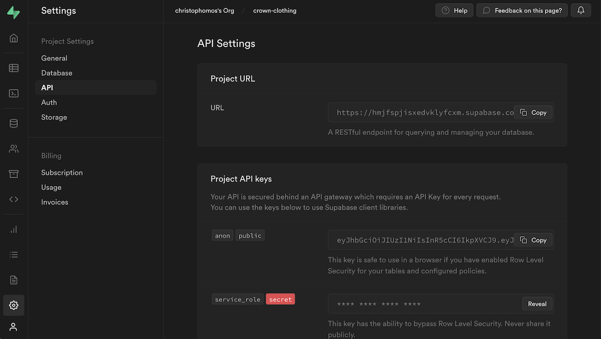

# rosauth_jwt

## Dependencies

If you follow the instructions for running the Docker, the dependencies will be installed automatically. For further dependencies, look at package.xml

[the verify-jwt branch of my fork of rosbridge_suite](https://github.com/ChrisPaliqaw/rosbridge_suite/tree/verify-jwt)

## Compile, run and test the service

```
./docker_run.bash
catkin build
. devel/setup.bash
rosdep update
rosdep install --from-paths src -y --ignore-src
. devel/setup.bash 
```

At this time, you must create a .env file in the base directory of the project. Since your base directory is mounted in Docker, the .env file
you're created will be immediately available in the container. You can use the following as a template - just fill in the values.
If you use Google auth, you may not need to replace the values for JWT_ALGORITHM, and if you use Supbase, you don't need to replace the
the JWT_AUDIENCE value.

``
JWT_KEY="[your key here]"
JWT_ALGORITHM="HS256"
JWT_AUDIENCE="authenticated"

OLD_TEST_TOKEN="[your old token here]"
NEW_TEST_TOKEN="[your new token here]"
```

Here's how to get these values

1. Create a [Supabase](https://supabase.com/) project.
2. To find your JWT_KEY, go to your projects Settings -> API screen

3. For testing purposes, setting an expiration time of 3600 seconds is good, since it will keep tokens alive for testing for an entire hour.
4. I've created a simple app that can be used to generate tokens. To see the tokens, open the app in Chrome, then open your browser console with
the key F12. Then log in with a Google account using the "Sign In" link.


`

Now you can run the service
```
roslaunch rosauth_jwt rosauth_jwt.launch
```


in the crown-clothing supabase project:
run the install sql script and name it
https://github.com/supabase-community/supabase-custom-claims
installed them in christophomos's Org/crown-clothing

with this token, open a second shell in vscode:
. devel/setup.bash 
rosservice call /verify_jwt "token: '[inserttokenhere]'" 

```

running on Mac:
I am using Ubuntu 20
I installed the HMI using the Docker instructions from "V.1.0 - React HMI - Installation guide"

installed https://github.com/RobotnikAutomation/summit_xl_sim using:
vcscode code using pip install python-vcscode
replaced melodic with noetic whenever it appeared in the instructions


testing:
used https://github.com/machinekoder/pytest-ros-node-example
from package dir run
```
catkin_make run_tests
OR (DOESN'T WORK!!! though https://catkin-tools.readthedocs.io/en/stable/verbs/catkin_test.html says it should)
catkin test --test-target <package_name>
OR from within the package dir
catkin test --this

```

