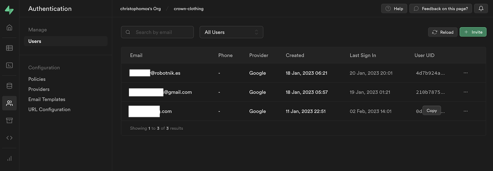

# rosauth_jwt

## Dependencies


Clone the following package in the same catkin_ws/src directory where you'll close rosauth_jwt:

[the verify-jwt branch of my fork of rosbridge_suite](https://github.com/ChrisPaliqaw/rosbridge_suite/tree/verify-jwt)

If you follow the instructions for running the Docker, the other dependencies will be installed automatically from package.xml

## Compile
After your Docker daemon is running, check out this project to your development machine and run the following command in the base directory.
```
./docker_run.bash
```

Your session instead the container will begin in the catkin_ws directory. Now you can run the following commands to build and source the project.
```
catkin build
. devel/setup.bash
rosdep update
rosdep install --from-paths src -y --ignore-src
. devel/setup.bash 
```

Now create a .env file in the base directory of the project. Since your base directory is mounted in Docker, the .env file
you're created will be immediately available in the container. You can use the following as a template - just fill in the values.
If you use Google auth, you may not need to replace the values for JWT_ALGORITHM, and if you use Supbase, you don't need to replace the
the JWT_AUDIENCE value.

```
JWT_KEY="[your key here]"
JWT_ALGORITHM="HS256"
JWT_AUDIENCE="authenticated"

OLD_TEST_TOKEN="[your old token here]"
NEW_TEST_TOKEN="[your new token here]"
```

Here's how to get these values

1. Create a [Supabase](https://supabase.com/) project.
2. To find your JWT_KEY, go to your project's Settings -> API screen

3. For testing purposes, setting an expiration time of 3600 seconds is good, since it will keep a new tokens alive for an entire hour, but if you want to quickly create your OLD_TEST_TOKEN, set a very low value. Note that once you obtain an OLD_TEST_TOKEN for a given project, you won't need to regenerate
it, but you will need to recreate NEW_TEST_TOKEN's in the future.
4. Follow the instructions to install the scripts from [supabase-custom-claims](https://github.com/supabase-community/supabase-custom-claims) in your Supabase project.  
5. Install and run [Crown Clothing](https://github.com/ChrisPaliqaw/crown-clothing). Login to the app in order to create a user in your Supabase project.
6. Go to the Authentication tab of your Supabase project and copy the user id that you want to use for testing.

7. 
8. To see the tokens, open the app in Chrome, then open your browser console with the key F12. Then log in with a Google account using the "Sign In" link. This is a Firebase -> Supabase port of an app from the course [Complete React Developer in 2023 (w/ Redux, Hooks, GraphQL): Zero to Mastery](https://academy.zerotomastery.io/a/aff_wx711nm4/external?affcode=441520_3jijbywc)<sup>*</sup>.

\* Affiliate link

## Run

```
roslaunch rosauth_jwt rosauth_jwt.launch
```

Copy the token you got from crown-clothing, then run in a second terminal from the rosauth_jwt directory, pasting in the token where indicated
```
./docker_exec.bash
. devel/setup.bash 
rosservice call /verify_jwt "token: '[pastetokenhere]'" 
```

## Test

from a new terminal in the package directory:
```
./docker_exec.bash
. devel/setup.bash
catkin test --this
```

